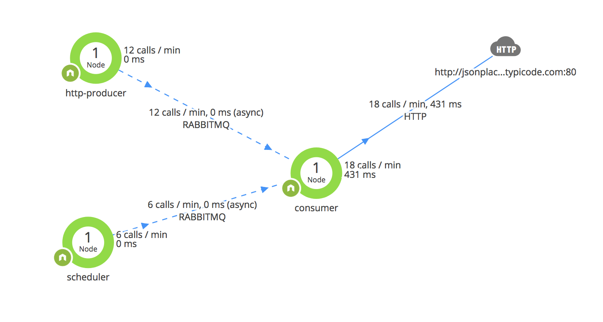

# appdyn-rabbit-lab
Custom agent instrumentation for rabbitMQ in appdynamics



All nodes connect to broker, creates channel and asserts the same queue.

- consumer consumes messages
- http-producer adds messages on http requests to `/`
- scheduler adds messages on a cron

# requirements
- Must have broker running

# usage
```bash
# runs 3 nodes and a curl
$ npm run party
```

# todos
- [ ] figure out where to add singularityheader in broker payload
- [ ] [monitor broker](https://www.appdynamics.com/community/exchange/extension/rabbitmq-monitoring-extension/)

# refs
https://gist.github.com/ayushghosh/140e36db94b111c3ea3d3eca69bfc34b
https://gist.github.com/kylefurlong/31ecd9554301b0d4d18d8beecd22ad71

# license
MIT
